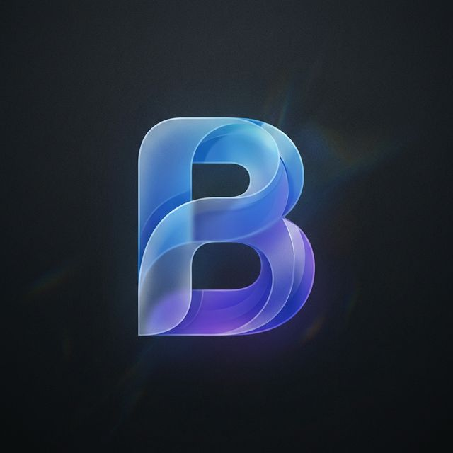

# Email Briefing 📰

Email Briefing is a desktop application that summarizes your Gmail inbox into a structured daily briefing.

Powered by **Electron**, **React**, and **Cohere Command R+**, it filters emails, categorizes them, and presents summaries in a clean dashboard.



## ✨ Features

- **Daily Briefing**: Summarizes 24h of emails (INBOX) into categorized points.
- **Clean UI**: Dark mode interface with clear visual hierarchy.
- **Backgrounds**: Customizable background options (Simple, Snow ❄️, Nebula 🌌).
- **Filtering**: Removes ads and introductory text to focus on content.
- **Sender Info**: Displays sender name and email for context.
- **Secure**: OAuth2 tokens and API keys are stored locally.

## 🚀 Installation

1.  Download the latest installer or build from source.
2.  Run the installer / developer setup to safeguard your API keys (Public Safe Mode).

## ⚙️ Configuration (Public Safe Mode)
This application is distributed in "Public Safe" mode. You must configure it **before** using it.

### 1. Google OAuth (Required for Email Access)
**Do this FIRST:** The app needs a `credentials.json` file to identify itself to Google.

#### How to generate `credentials.json` (Free):
1.  Go to the [Google Cloud Console](https://console.cloud.google.com/).
2.  **Create a New Project** (e.g., named "Email Briefing").
3.  **Enable Gmail API**:
    *   Go to **APIs & Services > Library**.
    *   Search for "Gmail API" and click **Enable**.
4.  **Configure Consent Screen**:
    *   Go to **APIs & Services > OAuth consent screen**.
    *   Select **External** -> Create.
    *   Fill in App Name ("Email Briefing") and emails.
    *   **Test Users**: Click "Add Users" and enter your own Gmail address. (Crucial for free usage).
5.  **Create Credentials**:
    *   Go to **APIs & Services > Credentials**.
    *   Click **+ CREATE CREDENTIALS** > **OAuth client ID**.
    *   Application type: **Desktop app**.
    *   Click **Create**.
6.  **Download**:
    *   Download the JSON file.
    *   **Rename** it to `credentials.json`.

#### Where to place it:
1.  Run the app once to create the necessary folders, then close it.
2.  Press `Win + R` on your keyboard.
3.  Paste: `%APPDATA%\email-briefing` and hit Enter.
4.  Paste your `credentials.json` file into this folder.

### 2. Cohere API Key (AI)
1.  Go to [Cohere Dashboard](https://dashboard.cohere.com/api-keys) and generate a **Trial API Key** (Free).
2.  Open Email Briefing App.
3.  Click **Settings** (Gear Icon).
4.  Paste your key into the "Cohere API Key" field and click **Save**.

## 🛠️ Development

### Prerequisites
- Node.js v18+
- Cohere API Key
- Google Cloud Project with Gmail API enabled (and `credentials.json`)

### Quick Start
```bash
# 1. Install dependencies
npm install

# 2. Setup Env
# Create .env with COHERE_API_KEY=your_key
# Place credentials.json in root

# 3. Run App
npm start

# 4. Build Installer
npm run dist
```

### Backgrounds & Visuals
The app supports 3 visual modes configurable in Settings:
- **Simple**: Minimalist network nodes.
- **Snow**: Falling emoji snowflakes (uses `tsparticles-shape-emoji`).
- **Nebula**: Advanced fluid-like interactive particle network.

## 🔒 Privacy
Email Briefing runs **locally** on your machine.
- Your emails are processed in memory and sent ONLY to Cohere for summarization.
- No data is sent to any other third-party servers.
- Tokens are stored on your device.

---

## 🏗️ Technical Architecture

### System Overview

```
┌─────────────────────────────────────────────────────────────────┐
│                        ELECTRON MAIN PROCESS                     │
│  ┌─────────────┐    ┌─────────────┐    ┌──────────────────────┐ │
│  │   Gmail     │───▶│   Email     │───▶│  Cohere AI           │ │
│  │   OAuth2    │    │   Parser    │    │  (command-r-08-2024) │ │
│  └─────────────┘    └─────────────┘    └──────────────────────┘ │
│         │                  │                      │              │
│         ▼                  ▼                      ▼              │
│  ┌─────────────────────────────────────────────────────────────┐│
│  │                    electron-store                            ││
│  │   (tokens, keys, history, settings, background_mode)         ││
│  └─────────────────────────────────────────────────────────────┘│
└─────────────────────────────────────────────────────────────────┘
                              │ IPC Bridge (preload.ts)
                              ▼
┌─────────────────────────────────────────────────────────────────┐
│                      REACT RENDERER PROCESS                      │
│  ┌─────────────┐    ┌─────────────┐    ┌──────────────────────┐ │
│  │   App.tsx   │───▶│   State     │───▶│  Refined UI          │ │
│  │  (Router)   │    │  Management │    │ (Popovers, Settings) │ │
│  └─────────────┘    └─────────────┘    └──────────────────────┘ │
│                            │                                    │
│                            ▼                                    │
│                 ┌──────────────────────┐                        │
│                 │  ParticlesBackground │                        │
│                 │  (tsparticles lib)   │                        │
│                 └──────────────────────┘                        │
└─────────────────────────────────────────────────────────────────┘
```

### Data Flow
1. **Auth**: User signs in via Google OAuth2 → tokens stored securely.
2. **Fetch**: Gmail API retrieves last 24h of emails from `INBOX`.
3. **Parse**: HTML converted to plain text via `html-to-text`.
4. **AI**: Parallel summarization (5 concurrent) via Cohere `command-r-08-2024`.
5. **Display**: Results rendered in React with glassmorphism + selected background.

### Key Files
| File | Purpose |
|------|---------|
| `electron/main.ts` | IPC handlers, OAuth, AI pipeline, Settings mgmt |
| `src/App.tsx` | React UI, Routing, Modal logic, Background switching |
| `src/ParticlesBackground.tsx` | Multi-mode animation engine |
| `src/index.css` | Glassmorphism design system |

### AI Summarization Pipeline

```typescript
// Per-email parallel processing with p-limit
const limit = pLimit(5); // Max 5 concurrent requests

const summarizeEmail = async (email) => {
  const response = await model.invoke([
    new SystemMessage(professionalPrompt),
    new HumanMessage(`EMAIL: ${email.subject}\nFROM: ${email.from}\n${email.body}`),
  ]);
  return JSON.parse(response.content);
};

const results = await Promise.all(
  emails.map(email => limit(() => summarizeEmail(email)))
);
```

## 🔒 Privacy
Email Briefing runs **locally** on your machine.
- Your emails are processed in memory and sent ONLY to Cohere for summarization.
- No data is sent to any other third-party servers.
- Tokens are stored on your device.

---
