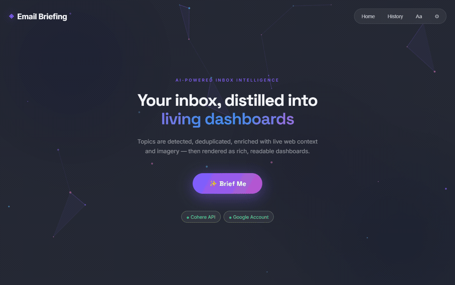

# Email Briefing 📰

Email Briefing is a desktop application that turns your Gmail inbox into **rich topic dashboards** — living, magazine-style reads enriched with live web context and imagery.

Powered by **Electron**, **React**, **LangChain**, and **Cohere Command R**, it reads your newsletters, extracts every distinct story, deduplicates them into topics, enriches each with free web search and images, and renders them as long-form dashboards you can actually enjoy reading.

<p align="center">
  
</p>

## ✨ Features

- **Topic Dashboards**: Emails are clustered into deduplicated topics; each becomes a full dashboard rendered with one of 5 templates (Pulse Board, Editorial, Chronicle, Spotlight, Matrix), streamed in as they generate.
- **Web Enrichment**: Every topic is enriched with live web search (DuckDuckGo → DuckDuckGo Lite → Bing fallback chain) and imagery (Wikipedia + Wikimedia Commons, with scenic fallbacks) — all free, no extra API keys.
- **Quick Bits**: One-line tidbits too small for a dashboard get their own emoji bullet grid, with the verbatim source sentence on hover.
- **Briefing Focus**: Edit the exact instructions that decide what becomes a dashboard (defaults to product/tech + world news; ads and think-pieces excluded).
- **Long-form Reading**: Full-sentence key points, stats, timelines, quotes, and "breather" images separating blocks of text. Key phrases highlighted.
- **In-app Email Reader**: Click any source email to read it in a large, formatted viewer (headings, bullets, clean paragraphs).
- **Reading Customization**: Themes (Midnight/Graphite/Light/Sepia), fonts, font size, line spacing, reading width, accent + highlight colors, background effects.
- **Notifications**: A chime + Windows notification when your briefing is ready to view; results reveal once half the dashboards are built.
- **History**: The last 10 briefings are saved locally, including source emails.
- **Diagnostics**: Session logs written to disk with a one-click **Copy Logs** button.
- **Secure**: OAuth2 tokens and API keys are stored locally, encrypted.

## 🚀 Installation

1.  Download the latest installer from [Releases](https://github.com/AkshitIreddy/Email-Briefing/releases) or build from source.
2.  Configure Google OAuth and your Cohere API key (below) before first use.

## ⚙️ Configuration (Public Safe Mode)
This application is distributed in "Public Safe" mode. You must configure it **before** using it.

### 1. Google OAuth (Required for Email Access)
**Do this FIRST:** The app needs a `credentials.json` file to identify itself to Google.

#### How to generate `credentials.json` (Free):
1.  Go to the [Google Cloud Console](https://console.cloud.google.com/).
2.  **Create a New Project** (e.g., named "Email Briefing").
3.  **Enable Gmail API**:
    *   Go to **APIs & Services > Library**.
    *   Search for "Gmail API" and click **Enable**.
4.  **Configure Consent Screen**:
    *   Go to **APIs & Services > OAuth consent screen**.
    *   Select **External** -> Create.
    *   Fill in App Name ("Email Briefing") and emails.
    *   **Test Users**: Click "Add Users" and enter your own Gmail address. (Crucial for free usage).
5.  **Create Credentials**:
    *   Go to **APIs & Services > Credentials**.
    *   Click **+ CREATE CREDENTIALS** > **OAuth client ID**.
    *   Application type: **Desktop app**.
    *   Click **Create**.
6.  **Download**:
    *   Download the JSON file.
    *   **Rename** it to `credentials.json`.

#### Where to place it:
1.  Run the app once to create the necessary folders, then close it.
2.  Press `Win + R` on your keyboard.
3.  Paste: `%APPDATA%\email-briefing` and hit Enter.
4.  Paste your `credentials.json` file into this folder.

### 2. Cohere API Key (AI)
1.  Go to [Cohere Dashboard](https://dashboard.cohere.com/api-keys) and generate a **Trial API Key** (Free).
2.  Open Email Briefing App.
3.  Click **Settings** (Gear Icon).
4.  Paste your key into the "Cohere API Key" field and click **Save**.
5.  Select your key type (Trial/Production) — trial keys get longer timeouts to absorb rate limiting.

> **Note:** On a trial key, a full briefing (topic planning + up to 20 dashboards) takes a few minutes. The first dashboards appear as soon as they're ready, and a chime tells you when the briefing is viewable.

## 🛠️ Development

### Prerequisites
- Node.js v18+
- Cohere API Key
- Google Cloud Project with Gmail API enabled (and `credentials.json`)

### Quick Start
```bash
# 1. Install dependencies
npm install

# 2. Setup Env
# Create .env with COHERE_API_KEY=your_key
# Place credentials.json in root

# 3. Run App
npm start

# 4. Build Installer
npm run dist

# 5. Re-record the README demo GIF (needs ffmpeg + a Chromium browser)
npm run dev          # in one terminal
npm run demo:gif     # in another → writes docs/demo.gif
```

See [`scripts/README.md`](scripts/README.md) for how the demo GIF is recorded.

## 🔒 Privacy
Email Briefing runs **locally** on your machine.
- Your emails are processed in memory and sent ONLY to Cohere for analysis.
- Web searches contain only topic names derived from your emails — never email content or personal data.
- No data is sent to any other third-party servers.
- Tokens, keys, and history are stored encrypted on your device.

---

## 🏗️ Technical Architecture

### System Overview

```
┌──────────────────────────────────────────────────────────────────────┐
│                         ELECTRON MAIN PROCESS                         │
│                                                                       │
│  ┌──────────┐   ┌──────────┐   ┌──────────────┐   ┌───────────────┐  │
│  │  Gmail   │──▶│  Email   │──▶│ Topic Planner│──▶│  Per-Topic    │  │
│  │  OAuth2  │   │  Parser  │   │ (Cohere, full│   │  Dashboard    │  │
│  └──────────┘   │ +Cleaner │   │  inbox text) │   │  Writer       │  │
│                 └──────────┘   └──────────────┘   └───────┬───────┘  │
│                                       │                   │          │
│                                       ▼                   ▼          │
│                  ┌────────────────────────────┐   ┌───────────────┐  │
│                  │ Web Enrichment (per topic) │   │ electron-store│  │
│                  │  DDG → DDG-lite → Bing     │   │ (encrypted:   │  │
│                  │  Wikipedia + Commons imgs  │   │ tokens, keys, │  │
│                  │  + image validation        │   │ history, prefs│  │
│                  └────────────────────────────┘   └───────────────┘  │
└──────────────────────────────┬───────────────────────────────────────┘
                               │ IPC Bridge (preload.ts)
                               │ streaming: progress / dashboards /
                               │ tidbits / email contents
                               ▼
┌──────────────────────────────────────────────────────────────────────┐
│                       REACT RENDERER PROCESS                          │
│  ┌──────────┐  ┌─────────────────┐  ┌──────────────────────────────┐ │
│  │ App.tsx  │─▶│ DashboardView   │─▶│ 5 templates: Pulse, Editorial│ │
│  │ (screens,│  │ (normalization, │  │ Chronicle, Spotlight, Matrix │ │
│  │  modals) │  │  rich text)     │  │ + Quick Bits + Email Reader  │ │
│  └──────────┘  └─────────────────┘  └──────────────────────────────┘ │
└──────────────────────────────────────────────────────────────────────┘
```

### Data Flow
1. **Auth**: Google OAuth2 sign-in → tokens stored encrypted, auto-refresh persisted.
2. **Fetch**: Gmail API retrieves inbox emails; MIME parts walked recursively; HTML stripped via `html-to-text` with snippet fallback.
3. **Plan**: One Cohere call reads the *full text* of every email and extracts all distinct topics (with importance scores, search queries, tidbits, and skip lists). Duplicates merged programmatically; topics ranked before the 20-dashboard ceiling.
4. **Enrich**: Per topic — web search (DDG→lite→Bing) and images (Wikipedia/Commons, validated) fetched in parallel.
5. **Write**: Per topic — Cohere generates long-form dashboard content from topic-relevant email excerpts + numbered search results, validated with Zod (nulls stripped, truncated JSON repaired, correction retries).
6. **Stream**: Dashboards, tidbits, and email contents stream to the renderer; results reveal at 50% with a notification chime.

### Key Files
| File | Purpose |
|------|---------|
| `electron/main.ts` | Pipeline (plan → enrich → write), search/image tools, OAuth, logging, IPC |
| `electron/types.ts` | Zod schemas for planner and dashboard outputs |
| `src/App.tsx` | Screens, modals, reader settings, email formatter, notifications |
| `src/DashboardView.tsx` | Dashboard templates, normalization, Twemoji, rich text |
| `src/index.css` | Themeable glassmorphism design system (4 themes) |

### Reliability Notes
- **Structured output**: prompt-embedded JSON schemas + Zod validation; `null` values stripped; truncated responses repaired by salvaging the complete prefix; one corrective re-prompt on format errors.
- **Rate-limit resilience**: escalating per-attempt timeouts (90s/135s/180s), exponential backoff on 429s, concurrency capped at 4.
- **Run supersession**: a new Brief Me cleanly cancels the in-flight run on both processes.
- **Logging**: all pipeline activity teed to `%APPDATA%/email-briefing/logs/main.log`; **Copy Logs** button in-app.
